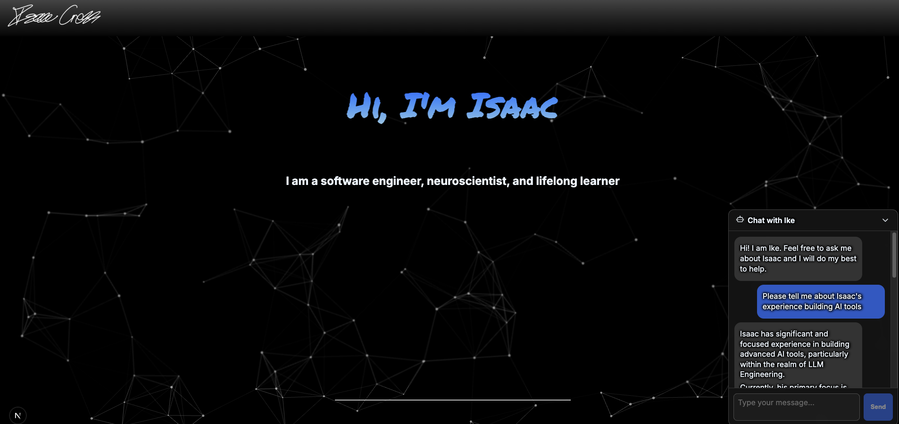

# Portfolio site

### Frontend

- **Next.js** — App router–style React framework.
- **React** — UI with JSX components and client interactivity.
- **Framer Motion** — Animation.
- **react-markdown** + **remark-gfm** — Markdown rendering (GFM tables, task lists, etc.).
- **CSS Modules** — Scoped styles (e.g. component-level `.module.css` files).
- **react-icons**, **react-responsive** — Icons and responsive helpers.
- **tsparticles** (react-tsparticles + tsparticles-slim) — Particle backgrounds.

### Backend and “Ike” assistant

- **Python** — Server code under `server/`.
- **FastAPI** — HTTP API (e.g. `POST /chat` with CORS for the Next dev server).
- **Pydantic** — Request/response models.
- **LangChain** (Chroma, Community, Hugging Face, Ollama, text splitters, core messages) — RAG pipeline: load markdown from `server/info/`, chunk, embed, retrieve, then stream a reply.
- **Chroma** — Persistent vector store (`server/vector_db/`) for portfolio content retrieval.
- **sentence-transformers** / **Hugging Face embeddings** — Embedding model `all-MiniLM-L6-v2` for similarity search.
- **Ollama** — Local LLM via LangChain’s `ChatOllama` (OpenAI-compatible tooling also appears in the server for alternate paths).

Python dependencies are declared in `server/pyproject.toml` (the repo uses a lockfile for reproducible installs).

### Testing and quality

- **Jest** with **Testing Library** — Unit and component tests.
- **Cypress** — End-to-end tests (dev dependency).

### How the pieces fit

The **Next.js** app is the public site and UI. The **FastAPI** service adds a RAG chat flow. Markdown about me is embedded into **Chroma**, user questions pull the most relevant chunks, and **Ollama** uses **Gemma4** to generate answers grounded on that context.